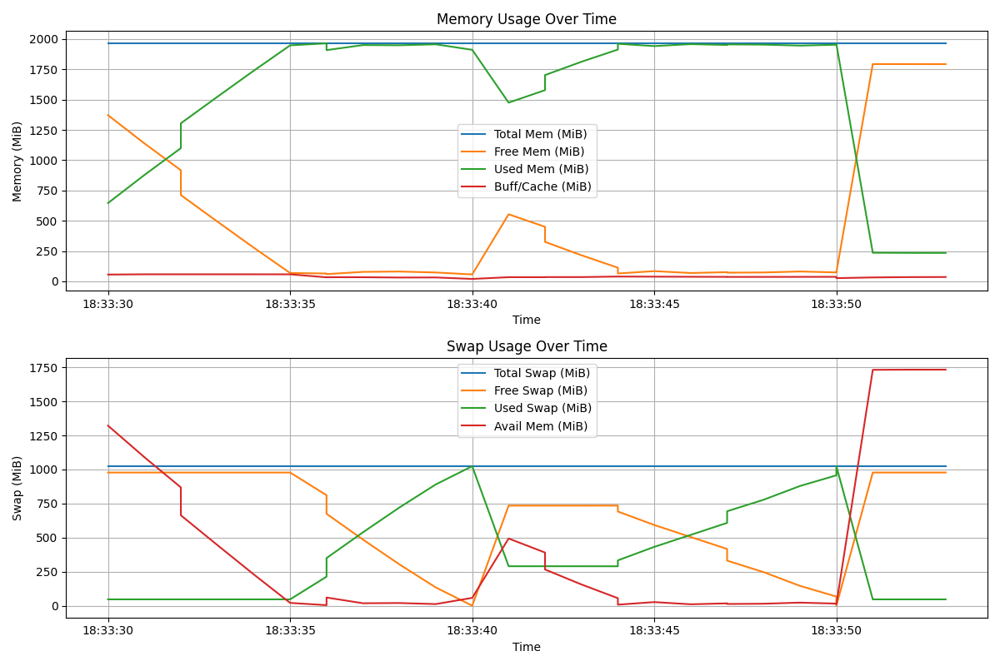

# Параметры системы

- **Общий объем оперативной памяти**: 2 GB
- **Объем раздела подкачки**: 1 GB
- **Размер страницы виртуальной памяти**: 4096 B
- **Объем свободной физической памяти в ненагруженной системе**: 1.5 GB
- **Объем свободного пространства в разделе подкачки в ненагруженной системе**: 1 GB

# Эксперимент 1

## Первый этап

Запущены процессы: `mem.bash` и `top_monitor.bash`

**Запись в системном журнале**:
```
[ 6621.378412] oom-kill:constraint=CONSTRAINT_NONE,nodemask=(null),cpuset=/,mems_allowed=0,global_oom,task_memcg=/user.slice/user-1000.slice/session-3.scope,task=mem.bash,pid=3361,uid=1000
[ 6621.378422] Out of memory: Killed process 3361 (mem.bash) total-vm:2816564kB, anon-rss:1805568kB, file-rss:1536kB, shmem-rss:0kB, UID:1000 pgtables:5552kB oom_score_adj:0
```

**Последняя запись в `report.log`**:

```
Step 3500000: Array size 35000000
```

## Второй этап

Запущены процессы: `mem.bash`, `mem2.bash` и `top_monitor2.bash`

**Запись в системном журнале для `mem.bash`**:

```
[ 8154.159523] oom-kill:constraint=CONSTRAINT_NONE,nodemask=(null),cpuset=/,mems_allowed=0,global_oom,task_memcg=/user.slice/user-1000.slice/session-3.scope,task=mem.bash,pid=5368,uid=1000
[ 8154.159578] Out of memory: Killed process 5368 (mem.bash) total-vm:1419344kB, anon-rss:632576kB, file-rss:1536kB, shmem-rss:0kB, UID:1000 pgtables:2812kB oom_score_adj:0
```

**Запись в `report.log` для `mem.bash`**:

```
Step 1800000: Array size 18000000
```

**Запись в системном журнале для `mem2.bash`**:

```
[ 8164.857244] oom-kill:constraint=CONSTRAINT_NONE,nodemask=(null),cpuset=/,mems_allowed=0,global_oom,task_memcg=/user.slice/user-1000.slice/session-3.scope,task=mem2.bash,pid=5369,uid=1000
[ 8164.857256] Out of memory: Killed process 5369 (mem2.bash) total-vm:2813792kB, anon-rss:1804800kB, file-rss:1920kB, shmem-rss:0kB, UID:1000 pgtables:5552kB oom_score_adj:0
```

**Запись в `report.log` для `mem2.bash`**:

```
Step 3500000: Array size 35000000
```


# Графики

## Первый этап

- 
- 
- 

## Второй этап

- 
- 
- 

# Выводы

1. Процессы завершаются (`oom-kill`), когда заканчивается как оперативная память, так и пространство подкачки (swap).
2. Swap-память начинает использоваться только после исчерпания оперативной памяти.
3. Процесс `kswapd0` появляется в топ-5 процессов, когда начинается использование swap. Вероятно, он отвечает за перемещение данных между оперативной памятью и диском (подкачкой).